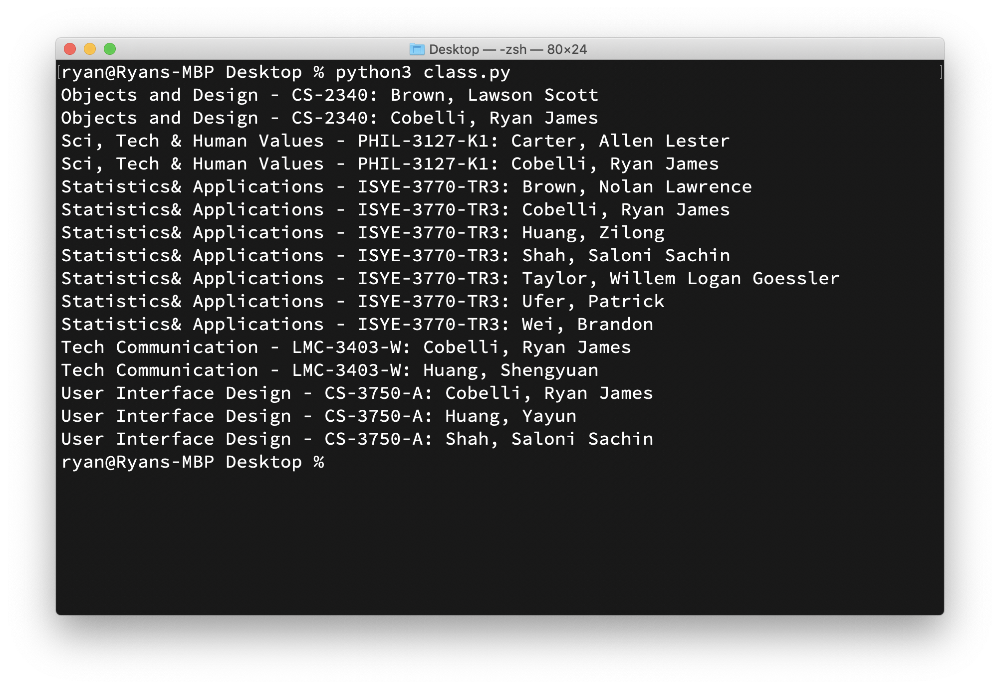

# Who's In Class With Me?
##### See who is in class with you

Python script to query the [Canvas LMS](https://www.instructure.com/canvas/) [API](https://canvas.instructure.com/doc/api/) to see if your friends are in class with you.

__Limitation:__ This script will generate a number of false positives because it will only check by last names. This is to prevent you from having to know the full, legal spelling of your friend's first name that is on file with the university. This was a significant issue during testing.

## Installation
1. Get an API key from Canvas
   1. Navigate to `Account` > `Settings` > `Approved Integrations`
   2. Click `+ Create New Access Token`
   3. Be sure to leave the expiration date blank
   4. Copy the token `api_key`
2. Populate the `friends` array with the last name of all your friends
3. Run the python script
